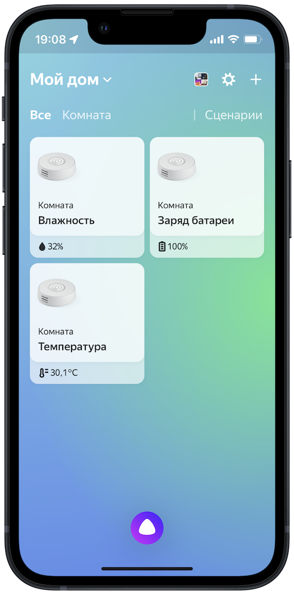
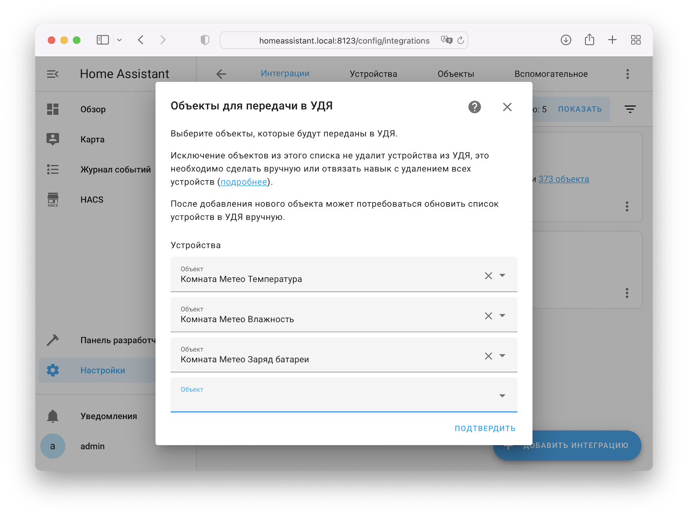
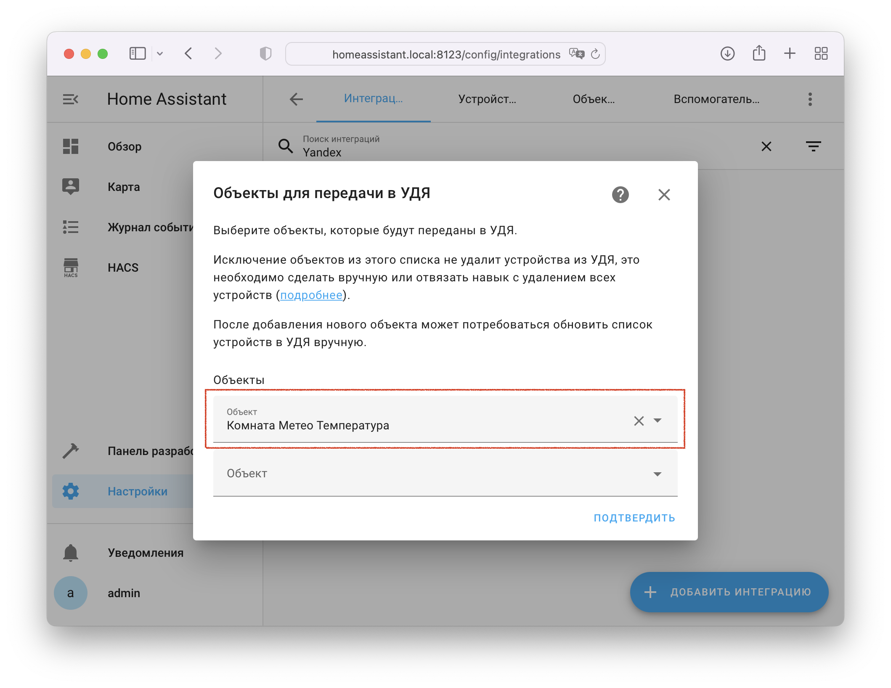
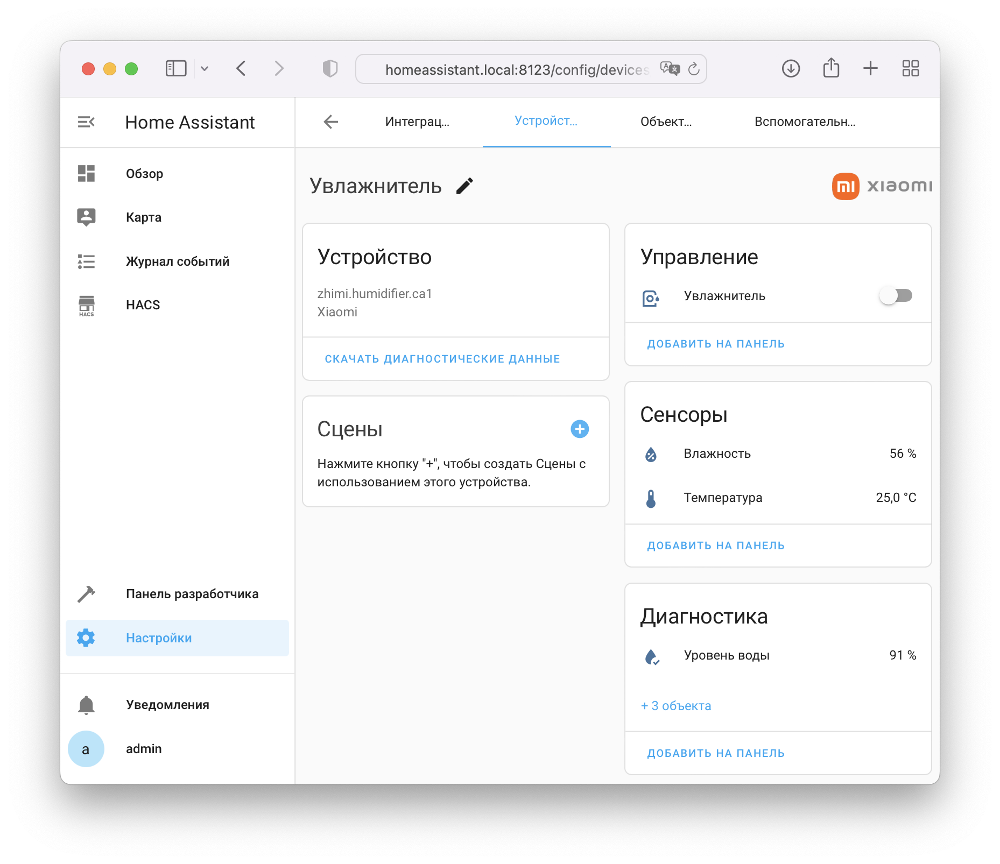
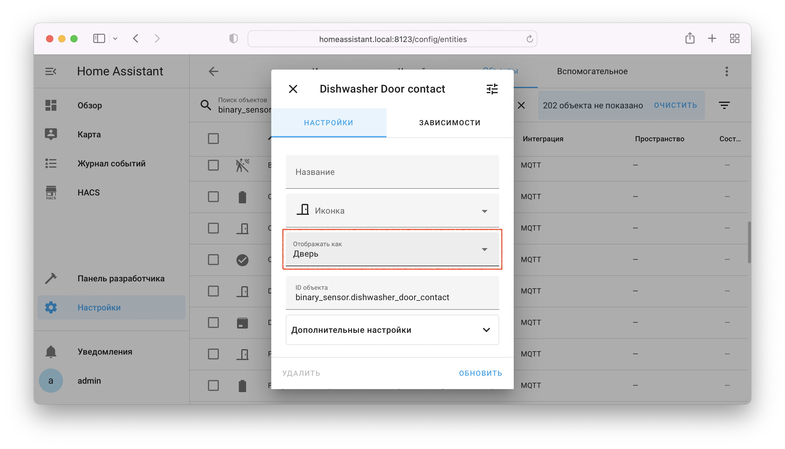

В УДЯ можно передавать цифровые и бинарные датчики, есть несколько способов сделать это:

## Один датчик - одно устройство { id=simple }
При выборе [поддерживаемых](../supported-devices.md#sensors) объектов в доменах `sensor` и `binary_sensor` в УДЯ будут созданы несколько независимых устройств:

{ width=480 }
{ width=200 }
{ width=480 }

## Сборка несколько датчиков в одно устройство { id=combine }
В [первом способе](#simple) одно физическое устройство (датчик температуры/влажности) передавалась в УДЯ как несколько независимых устройств, и это в большинстве случаев неудобно. 

Есть способ лучше! Мы можем объединить несколько независмых объектов в одно устройство через [YAML конфигурацию](../config/getting-started.md#yaml). 

В качестве примера возьмём этот же датчик температуры/влажности:

{ width=750 }

Он содержит несколько объектов, нам нужно [выяснить](../faq.md#get-entity-id) их `entity_id`. В нашем примере это будут:

* Температура: `sensor.room_temperature`
* Влажность: `sensor.room_humidity`
* Уровень заряда: `sensor.room_meteo_battery_level`

Так же для примера добавим ещё несколько датчиков из других физических устройств:

* Уровень CO2: `sensor.room_co2_level`
* Освещённость: `sensor.room_illumination_lux` 

В Home Assistant нет объекта, на который мы могли бы добавить эти сенсоры. 
Поэтому в качестве объекта, из которого будут создано устройство в УДЯ, нужно выбрать **любой** существующий объект, возьмём для этих целей температуру (`sensor.room_temperature`).

!!! example "configuration.yaml"
    ```yaml
    yandex_smart_home:
      entity_config:
        sensor.room_temperature:
          name: Погода в комнате
          properties:
            - type: temperature
              entity: sensor.room_temperature
            - type: humidity
              entity: sensor.room_humidity
            - type: co2_level
              entity: sensor.room_co2_level
            - type: illumination
              entity: sensor.room_illumination_lux
            - type: battery_level
              entity: sensor.room_meteo_battery_level
    ```

Датчики, заданные в `properties`, обладают большим приоритетом над обнаруженными автоматически. 
По этой причине мы вручную добавил датчик `temperature` вверх списка. Если этого не сделать - он будет в конце (как автоматически обнаруженный для `sensor.room_temperature`).

!!! tip "Порядок датчиков в `properties` влияет на порядок отображения в УДЯ"

В [объектах для передачи в УДЯ](../config/filter.md) нужно выбрать **только** `sensor.room_temperature`.

{ width=480 }
{ width=200 }

## Добавление датчиков к устройству { id=attach }

Некоторые устройства (термостат) уже содержат в своих атрибутах датчики, которые будет подхвачены автоматически. 
А некоторые, например, увлажнитель - наоборот, все датчики выносят в отдельные объекты.

В качестве примера используем увлажнитель Xiaomi, он состоит из объектов:

* Непосредственно увлажнитель: `humidifier.air_humidifier`
* Температура: `sensor.air_humidifier_temperature`
* Влажность: `sensor.air_humidifier_humidity`
* Уровень воды: `sensor.air_humidifier_water_level`

И дополнительно добавим к нему:

* Потребляемый ток: `switch.humidifer_socket`, значение в атрибуте `current_consumption`

!!! example "configuration.yaml"
    ```yaml
    yandex_smart_home:
      entity_config:
        humidifier.air_humidifier:
          properties:
            - type: water_level
              entity: sensor.air_humidifier_water_level
            - type: temperature
              entity: sensor.air_humidifier_temperature
            - type: humidity
              entity: sensor.air_humidifier_humidity
            - type: power
              entity: switch.humidifer_socket
              attribute: current_consumption
    ```

!!! tip "Порядок датчиков в `properties` влияет на порядок отображения в УДЯ"

В объектах для передачи в УДЯ нужно выбрать **только** `humidifier.air_humidifier`.

{ width=480 }
{ width=200 }

## Параметры датчиков { id=properties }

Раздел `properties` в `entity_config` является списком датчиков. Каждый датчик имеет один или несколько параметров:

| Параметр              | Значение по умолчанию                           | Описание                                                                                                                                                                                                                                       |
|-----------------------|-------------------------------------------------|------------------------------------------------------------------------------------------------------------------------------------------------------------------------------------------------------------------------------------------------|
| `type`                | Нет                                             | Тип датчика. Возможные значения: [цифровые датчики](https://yandex.ru/dev/dialogs/smart-home/doc/concepts/float-instance.html), [бинарные датчики](https://yandex.ru/dev/dialogs/smart-home/doc/concepts/event-instance.html) (кроме `button`) |
 | `entity`              | Объект, для которого <br >задаются `properties` | [ID объекта](../faq.md#get-entity-id), в котором содержится значение датчика (для цифровых - число, для бинарных - `on/off`)                                                                                                                   |
 | `attribute`           | Нет                                             | Атрибут, в котором содержится значение датчика. Заполняется **только** если значение хранится не в состоянии объекта                                                                                                                           | 
| `unit_of_measurement` | Из атрибута объекта `unit_of_measurement`       | Единица измерения, в которой в HA находятся значения датчика (для [конвертации значений](#unit-of-measurement))                                                                                                                                |                                                                                                                

## Конвертация значений { id=unit-of-measurement }
Компонент автоматически конвертирует значения сенсоров из одних единиц измерения в другие на основании атрибута/параметра `unit_of_measurement`. 

Атрибут содержит единицу измерения, в которой находится значение датчика в Home Assistant. 

Если у объекта атрибут отсутствует (или неверный), его можно задать через параметр `unit_of_measurement` в `properties`.

!!! info "Возможные значения `unit_of_measurement` смотрите в [списке поддерживаемых датчиков](../supported-devices.md#sensors)"

!!! example "Пример"
    ```yaml
     yandex_smart_home:
       entity_config:
         humidifier.bedroom:
           properties:
             - type: tvoc
               attribute: total_volatile_organic_compounds
               unit_of_measurement: ppb  # для автоматической конвертации из миллиардных долей в мкг/м³
    ```

## Выбор класса бинарного датчика { id=device-class }
Некоторые интеграции создают бинарные датчики с пустым или неверным атрибутом `device_class`. Такие датчики автоматически обнаружены не будут.

Вы можете самостоятельно задать атрибут `device_class` через параметр объекта `Отображать как` в `Настройки` --> `Устройства и объекты` --> [`Объекты`](https://my.home-assistant.io/redirect/entities/)

{ width=750 }

## Особенности бинарных датчиков в УДЯ { id=quirks }
В УДЯ не передаётся текущее состояние бинарного датчика, а передаются только события/изменения его состояния. 

Из этого следует несколько особенностей:

1. Для отображения "статуса" в УДЯ датчик должен поменять своё состояние в Home Assistant (например открыть дверь или нажать кнопку)
2. Алиса не будет произносить в каком состоянии сейчас находится датчик

!!! bug "Перезагрузка Home Assistant приводит к отображению "прочерков" у бинарных датчиков в списке устройств в приложении Дом с Алисой. Это известная проблема на стороне УДЯ."
